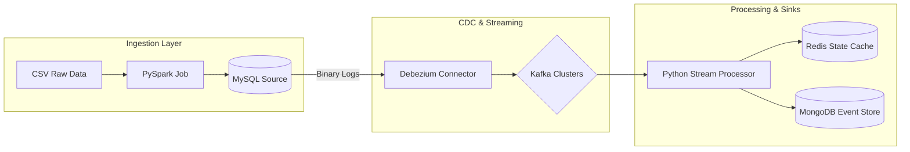

# 🚚 Logistics Real-time CDC Pipeline

Hệ thống xử lý dữ liệu (Data Pipeline) hiện đại cho ngành Logistics, xây dựng trên kiến trúc **Event-Driven Analysis (EDA)**. Hệ thống giải quyết bài toán giám sát hành trình thời gian thực bằng kỹ thuật **Change Data Capture (CDC)**, giúp đồng bộ hóa dữ liệu từ nguồn (SOT) tới đa dạng các tầng lưu trữ (Multi-sink) với độ trễ tối thiểu.

## 🏗️ Kiến trúc Hệ thống (Architecture)

Hệ thống được thiết kế để tách biệt (Decoupling) giữa luồng ghi dữ liệu và luồng xử lý báo cáo, đảm bảo hiệu suất cao cho cơ sở dữ liệu gốc.



### 🏛️ Chiến lược Lưu trữ (Polyglot Persistence)

Lựa chọn 3 loại cơ sở dữ liệu để tối ưu hóa cho từng mục đích sử dụng cụ thể:

- **MySQL (RDBMS):** Đóng vai trò là **Source of Truth (SOT)**. Sử dụng 2 bảng tách biệt (`Bookings_Active` cho các chuyến xe đang vận hành và `Bookings_History` cho dữ liệu lịch sử) để tối ưu hóa hiệu năng truy vấn và giúp Debezium tập trung capture chính xác các sự kiện thay đổi trạng thái (In-transit).
- **Redis (In-memory):** **Real-time Serving Layer**. Cung cấp dữ liệu snapshot trạng thái xe tức thì (sub-millisecond) cho Dashboard, quản lý danh sách xe đang chạy/bị trễ thông qua Redis Sets.
- **MongoDB (Document):** **Historical Event Store**. Lưu trữ toàn bộ lịch sử thay đổi (Audit Trail) dưới dạng Document JSON linh hoạt, phục vụ truy vết hành trình và phân tích sâu sau này.

## 🚀 Tính năng Kỹ thuật chính (Key Features)

- **Real-time CDC Pipeline:** Tự động bắt sự kiện (Insert/Update) từ MySQL Binlog thông qua Debezium mà không cần sử dụng Triggers, giúp giảm 90% overhead so với cơ chế Polling truyền thống.
- **Automated Business Logic:** Stream Processor tự động tính toán độ trễ (Delay) và phân loại trạng thái chuyến xe (Created, In-transit, Completed) ngay trên luồng dữ liệu.
- **Scalable Data Ingestion:** Sử dụng Spark để bóc tách, ánh xạ và nạp hàng ngàn bản ghi từ file thô vào cơ sở dữ liệu một cách tối ưu.
- **Fault Tolerance:** Tận dụng Kafka làm vùng đệm dữ liệu (Backpressure) và lưu trữ Offset để đảm bảo hệ thống có thể phục hồi dữ liệu ngay tại vị trí dừng nếu gặp sự cố.

## 📁 Cấu trúc Project (Project Layout)

- `src/spark/`: Pipeline nạp dữ liệu ban đầu (Initial Load) và Transform.
- `src/ETL/`: Core Logic của CDC bao gồm Connector Registration và Stream Consumer.
- `src/database/`: Các module kết nối cơ sở dữ liệu tối ưu (Connection Pooling).
- `src/sql/`: Schema định nghĩa cấu trúc dữ liệu tối ưu cho giám sát GPS & SLA.

## 🛠️ Tech Stack & Infrastructure

- **Languages:** Python, SQL, PySpark.

* **Infrastructure:** Docker & Docker Compose.
* **Streaming:** Apache Kafka, Debezium MySQL Connector.
* **Storage:** MySQL 8.0, MongoDB 6.0, Redis 7.0.

## Hướng dẫn cài đặt

```bash
# Clone repository
git clone <repository-url>
cd DE_ETL

# Cài đặt môi trường Python
python -m venv .venv
source .venv/bin/activate  # On Windows: .venv\Scripts\activate
pip install -r requirements.txt

# Khởi động hạ tầng Docker
docker-compose up -d
```

### ⚙️ Vận hành Pipeline (Execution)

Quy trình triển khai dữ liệu theo trình tự sau:

1. **Kích hoạt CDC Engine:**
   Đăng ký MySQL Connector với Debezium để bắt đầu theo dõi log.

   ```powershell
   python src/ETL/register_debezium.py
   ```

2. **Khởi tạo dữ liệu ban đầu (Initial Load):**
   Sử dụng Spark để chuẩn hóa và nạp dữ liệu từ CSV vào MySQL.

   ```powershell
   $env:PYTHONPATH="src"; python src/spark/mainSpark.py
   ```

3. **Bật Stream Processor:**
   Chạy Consumer để tiêu thụ sự kiện từ Kafka và đồng bộ sang Redis/MongoDB.
   ```powershell
   $env:PYTHONPATH="src"; python src/ETL/consumer-spark.py
   ```

> **Lưu ý:** Đảm bảo tệp `.env` đã được cấu hình đúng thông số kết nối (Host, Port, User/Pass) trước khi thực hiện các bước trên.

---
